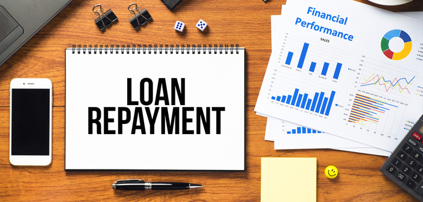

## GOAL:
Given historical data on loans given out with information on whether or not the borrower defaulted (charge-off), 
we built a model that can predict whether or nor a borrower will pay back their loan. This way in the future when we get a new potential customer,we can assess whether or not they are likely to pay back the loan.

There were lots of challlenges that I faced while preparing the data for model building. There are  300000+ records and 70+ features, so I had to remove some features which were not particularly useful. The most difficult and the most important task was to preprocess and visualize the data as that have me an idea about the dataset before model building and evaluation. 
Dataset: https://www.kaggle.com/wordsforthewise/lending-club
